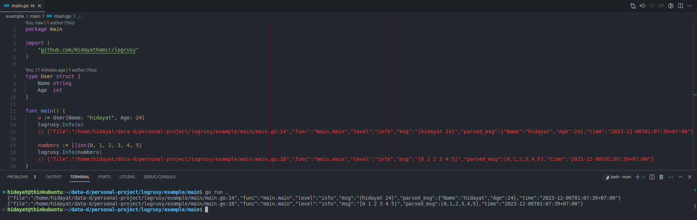

# Logrusy

Logrusy is a customized version of Logrus that facilitates automatic parsing of log messages into JSON format. It retains all the features present in Logrus while adding the functionality for JSON log message parsing. Look at field `parsed_msg` in the example below.

## How to Use

To see Logrusy in action, refer to the sample file [./example/main/main.go](./example/main/main.go)

Did you notice field `parsed_msg` there?
